<![CDATA[# 🏢 SocietyFund — Housing Society Financial Transparency & Management Platform

> A production-grade, full-stack web application built to eliminate financial opacity, manual bookkeeping errors, and delayed reporting in Indian cooperative housing societies. Features **real-time dashboards**, **statutory fund management**, **automated maintenance billing**, **certified PDF exports**, and **tamper-evident audit trails** — all accessible via role-based portals for Treasurers and Residents.

---

## 📸 Screenshots

### Authentication & Onboarding

| Login Portal | Registration Form |
|:---:|:---:|
| 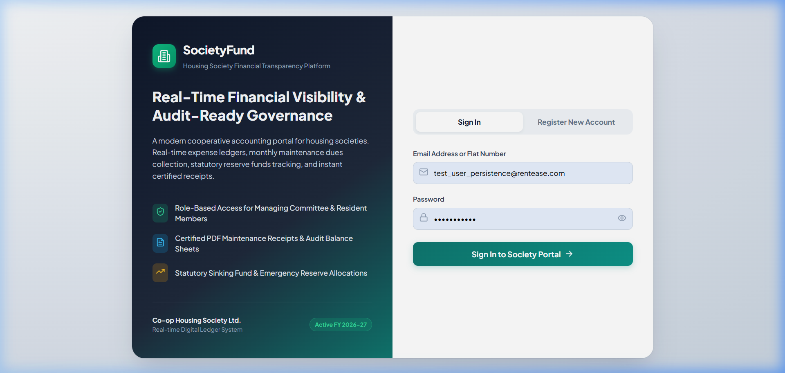 | 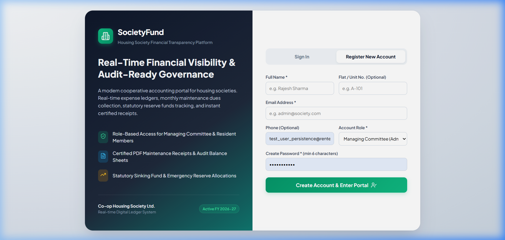 |

### Admin / Treasurer Financial Suite

| Executive Dashboard | Income Management |
|:---:|:---:|
| 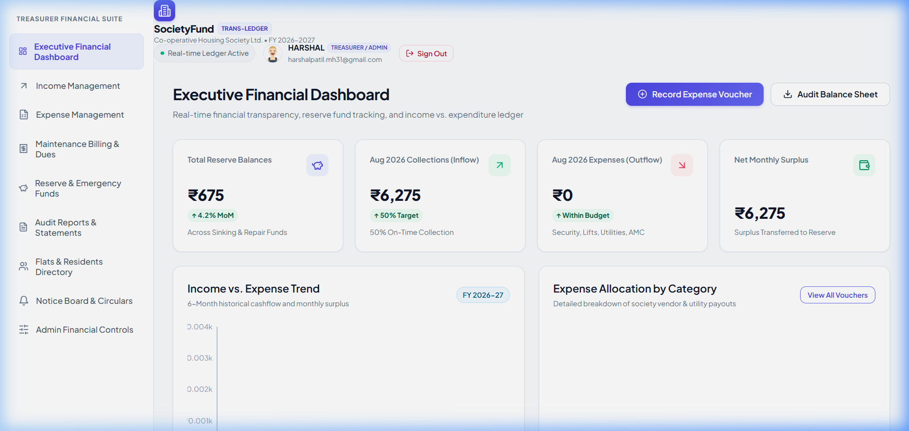 | 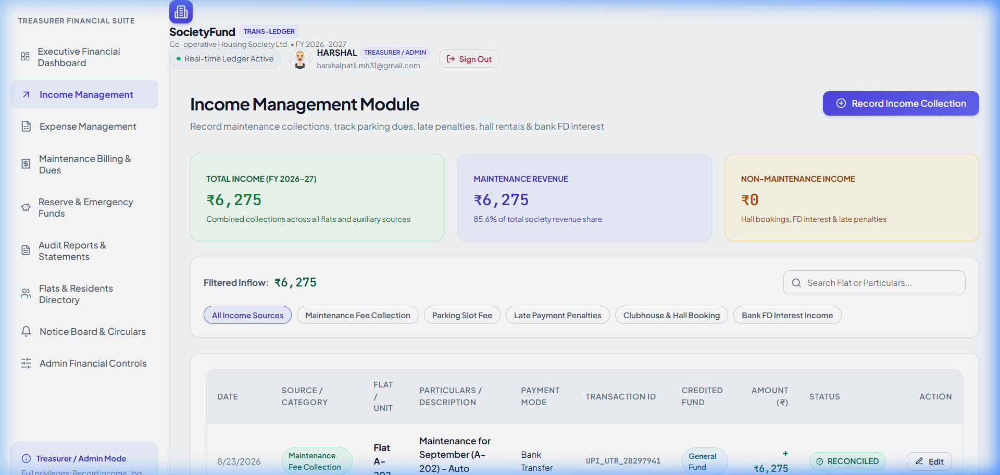 |

| Expense Management | Maintenance Billing & Dues |
|:---:|:---:|
| 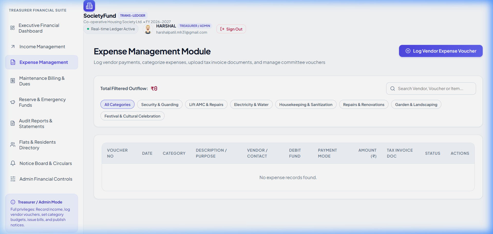 | 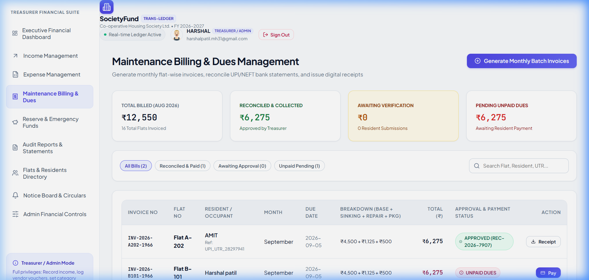 |

| Reserve & Emergency Funds | Audit Reports & Statements |
|:---:|:---:|
| 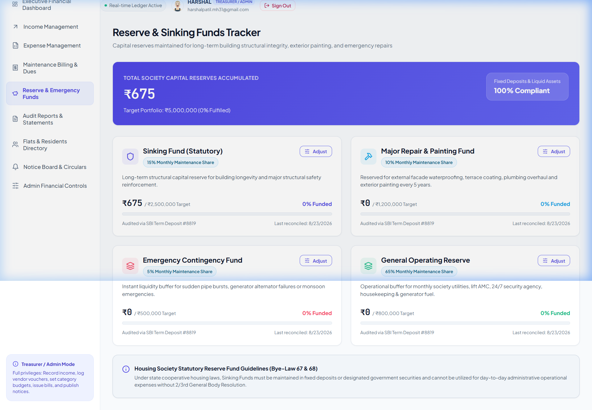 | 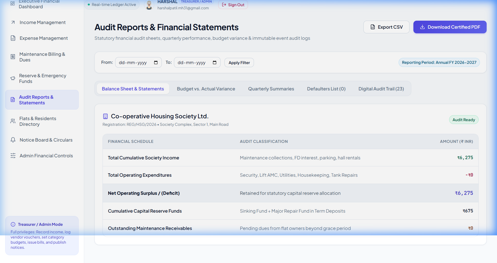 |

| Flats & Residents Directory | Notice Board & Circulars |
|:---:|:---:|
| 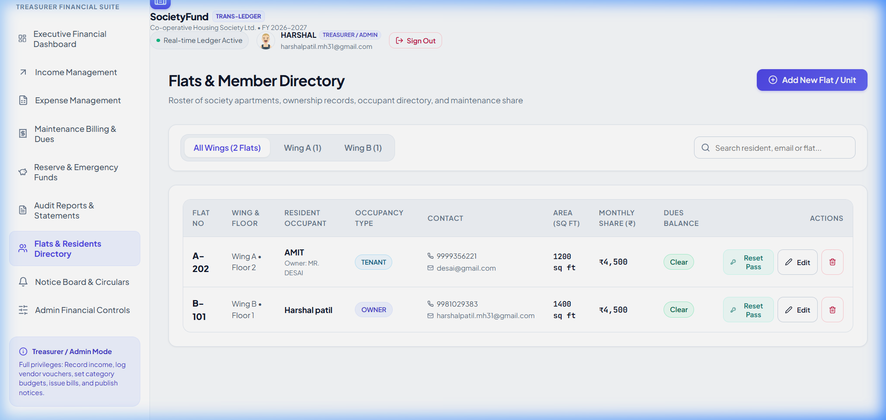 | 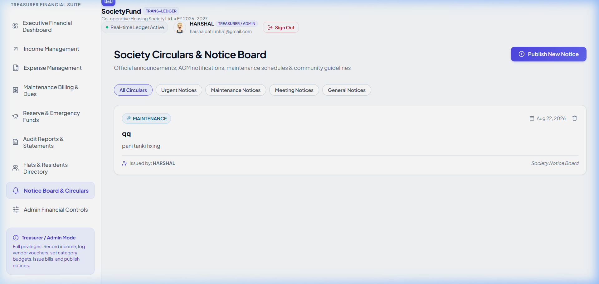 |

| Admin Financial Controls |
|:---:|
| 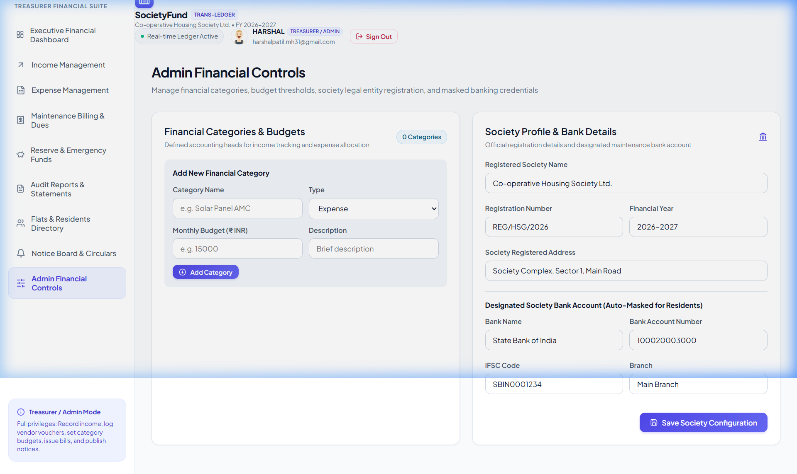 |

### Resident Self-Service Portal

| My Flat & Payment Status | Fund Summary & Expenses |
|:---:|:---:|
| 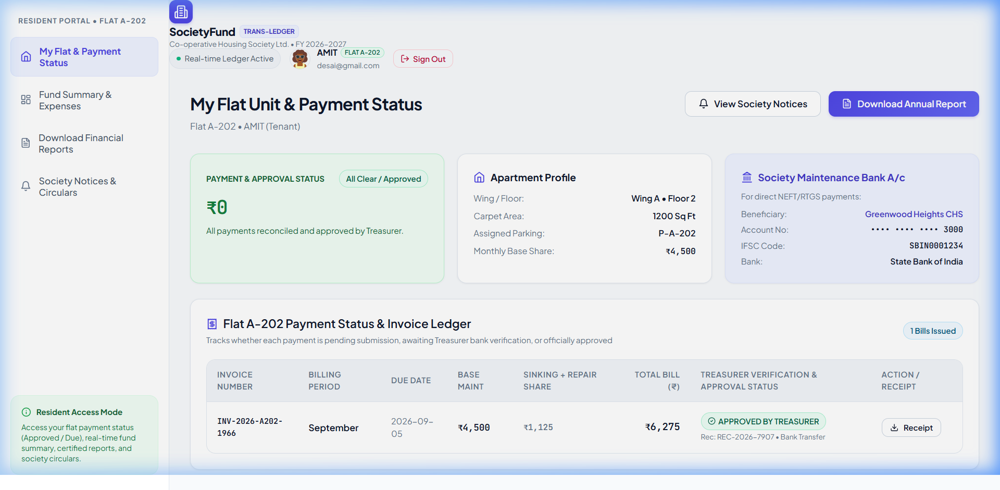 | 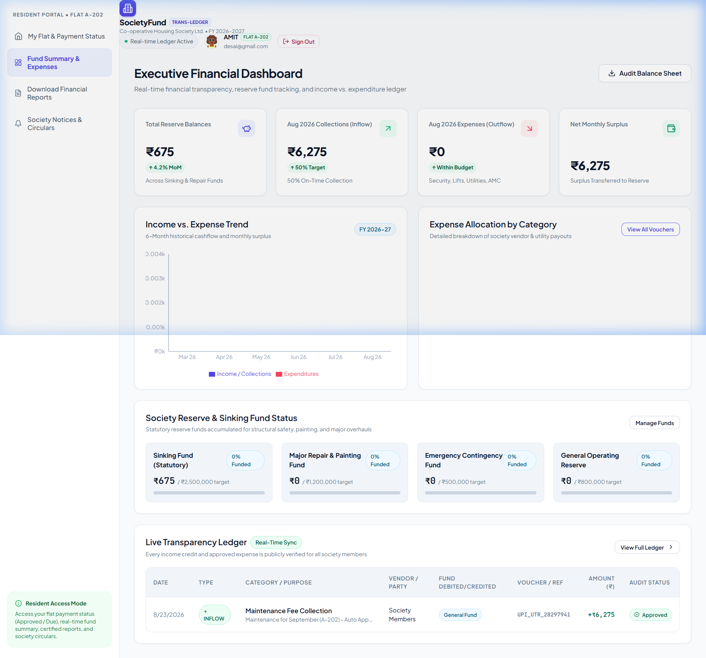 |

| Download Financial Reports | Society Notices & Circulars |
|:---:|:---:|
| 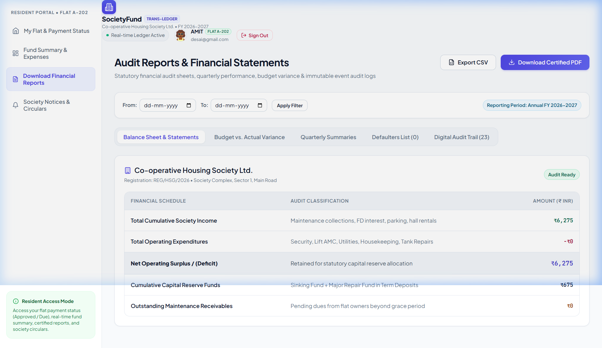 | 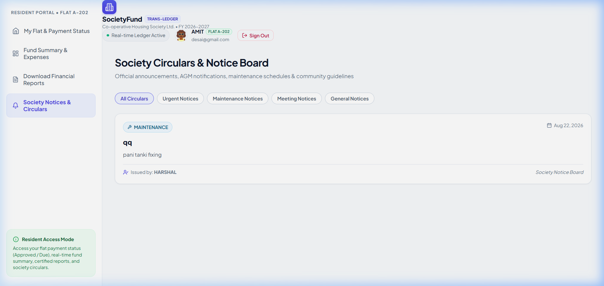 |

---

## ✨ Key Features & Modules

### 1. 🔐 Secure Authentication & Role-Based Access

- **JWT-based authentication** with Bcrypt password hashing.
- Login via **Email** or **Flat Number** (e.g., `A-101`).
- Two distinct portals:
  - **Treasurer / Admin** — Full financial management suite (9 modules).
  - **Resident** — Flat payment status, fund summary, reports, and notices (4 modules).
- First-time password change enforcement for admin-created resident accounts.
- Admin password reset for residents.
- Role switching and flat switching for multi-flat owners.

### 2. 📊 Executive Financial Dashboard

- **Live KPI cards**: Total Reserve Balance, Monthly Inflow, Monthly Outflow, Net Surplus/Deficit, On-Time Collection Rate.
- **Interactive Recharts visualizations**:
  - 6-Month Income vs Expenses bar chart.
  - Category-wise Expense Donut chart with color-coded segments.
  - Income trend area chart.
- **Public Transparency Feed**: Real-time synchronized ledger of every income credit and approved expense — visible to all residents.
- Quick action buttons for recording expenses directly from dashboard.
- Invoice receipt modal with digital verification seal.

### 3. 💰 Income Management

- Record multi-source income: Maintenance Collections, Parking Dues, Late Payment Penalties, Clubhouse Hall Rentals, FD Interest, Donations.
- Category-tagged entries with payment mode tracking (UPI, Netbanking, Cash, Cheque, Bank Transfer).
- Reference/transaction ID capture for digital payments.
- Associated flat selection for resident-linked income.
- Automated reserve fund crediting from maintenance collections.
- Monthly and yearly income analytics with filtering.

### 4. 📋 Expense Management

- Log vendor payments with vendor name, contact, invoice number, and category classification.
- Multi-stage approval workflow (Managing Committee approval with Pending → Approved states).
- Payment mode and reference tracking for complete audit trail.
- Category budget monitoring against approved allocations.
- Expense editing and deletion with full audit logging.

### 5. 🏠 Maintenance Billing & Dues Management

- **Automated flat-wise billing** with statutory component splits:
  - Sinking Fund share (15%)
  - Major Repair Fund share (10%)
  - Operating Maintenance, Parking Charges, Water Charges, and Overdue Penalties.
- **Batch invoice generation** — Generate bills for all registered flats in a single click.
- Instant payment recording (UPI, Netbanking, Debit Card) with automated receipt creation.
- **Official Printable & Downloadable PDF Maintenance Receipt** with society letterhead, statutory breakdown, and digital verification seal.
- Payment approval workflow for treasurer verification.
- Auto-reconciliation engine for bulk payment approvals.
- Status tracking: Paid ✅ | Pending ⏳ | Overdue ❌ | Pending Approval 🔄.

### 6. 🏦 Reserve & Sinking Funds Tracker

- **4 Statutory Capital Reserve Funds**:
  - 🏗️ **Sinking Fund (Statutory)** — 15% allocation for building longevity and structural reinforcement.
  - 🎨 **Major Repair & Painting Fund** — 10% for exterior waterproofing, terrace coating, and painting cycles.
  - 🚨 **Emergency Contingency Fund** — 5% instant liquidity buffer for pipe bursts, generator failures, monsoon damage.
  - 🔧 **General Operating Reserve** — 65% operational buffer for daily utilities, security, lift AMC, and housekeeping.
- Target vs. Actual funded ratio with progress indicators.
- Committee deposit/withdrawal operations with notes and audit logging.
- Color-coded fund health visualization.

### 7. 📑 Audit-Ready Financial Statements

- **Annual Balance Sheet** with assets, liabilities, and reserves.
- **Income & Expenditure Account** schedule.
- **Budget vs. Actual** variance analysis with percentage deviation.
- **Quarterly financial performance** reporting.
- **Defaulter Report** — Flat-wise overdue payments list.
- **Digital Audit Trail** — Tamper-evident log with actor timestamps, IP addresses, session IDs, and action details.
- **Single-click export engine**:
  - 📄 Certified **PDF** reports with society letterhead.
  - 📊 **CSV** data export for Excel analysis.
- Date range filtering for custom period reports.

### 8. 🏘️ Flats & Residents Directory

- Register society apartments with wing, floor, area (sq. ft.), and parking slot.
- Full ownership and tenant records with occupant type tracking.
- Contact directory (phone, email) for all residents.
- Monthly maintenance amount configuration per flat.
- Balance due tracking at flat level.
- Admin operations: Add, Edit, Remove units.
- Automatic resident user account creation with configurable initial passwords.

### 9. 📢 Notice Board & Circulars

- Publish official circulars, AGM notifications, maintenance alerts, and general society updates.
- Category classification: 🔴 Urgent | 🔧 Maintenance | 📋 Meeting | 📌 General.
- Pin important notices to top.
- Active/inactive notice management.
- Expiry date support for time-sensitive notices.
- Rich text content with full CRUD operations.

### 10. ⚙️ Admin Financial Controls

- **Society Profile Configuration**: Name, Registration Number, Address, Financial Year.
- **Bank Account Details**: Bank Name, Account Number, IFSC Code, Branch.
- **Category Budget Management**:
  - Create and configure income/expense categories with monthly budgets.
  - Color-coded category badges.
  - Active/inactive category toggle.
  - Delete unused categories.
- **Financial Year Management**: Create, activate, and lock financial years.

### 11. 🏠 Resident Self-Service Portal (My Flat)

- Personal flat details card with ownership/tenancy info.
- Complete maintenance invoice history with status indicators.
- **Self-service payment** with payment method selection (UPI, Netbanking, Debit Card).
- Downloadable PDF receipt with society branding and statutory breakdown.
- Society contact information card.
- Quick navigation to fund summary, reports, and notices.

---

## 🏗️ Architecture

```
societyfund/
├── frontend/                        # React 18 + Vite + TypeScript
│   ├── src/
│   │   ├── components/              # 14 Reusable UI Components
│   │   │   ├── Navbar.tsx           # Top navigation bar with role display
│   │   │   ├── Sidebar.tsx          # Role-aware sidebar navigation
│   │   │   ├── StatCard.tsx         # KPI stat card component
│   │   │   ├── ToastNotification.tsx # Global toast notification system
│   │   │   ├── AddIncomeModal.tsx   # Multi-category income form
│   │   │   ├── AddExpenseModal.tsx  # Vendor expense form with categories
│   │   │   ├── EditTransactionModal.tsx
│   │   │   ├── PayInvoiceModal.tsx  # Payment flow with method selection
│   │   │   ├── InvoiceReceiptModal.tsx # PDF receipt with digital seal
│   │   │   ├── BatchInvoiceModal.tsx # Bulk bill generator
│   │   │   ├── FundAdjustModal.tsx  # Reserve fund deposit/withdrawal
│   │   │   ├── LoginModal.tsx       # Quick login modal
│   │   │   ├── FirstTimePasswordModal.tsx # Forced password change
│   │   │   └── ResidentSwitcherModal.tsx  # Flat/role switcher
│   │   ├── pages/                   # 11 Full Page Views
│   │   │   ├── AuthPage.tsx         # Login + Registration (593 lines)
│   │   │   ├── Dashboard.tsx        # Executive financial dashboard
│   │   │   ├── Income.tsx           # Income management
│   │   │   ├── Expenses.tsx         # Expense management + approvals
│   │   │   ├── Maintenance.tsx      # Billing, invoices, batch generation
│   │   │   ├── ReserveFunds.tsx     # 4-fund statutory tracker
│   │   │   ├── AuditReports.tsx     # Balance sheet, budget analysis, audit trail
│   │   │   ├── Members.tsx          # Flat & resident directory (37K+ bytes)
│   │   │   ├── AdminControls.tsx    # Category budgets & society config
│   │   │   ├── Notices.tsx          # Notice board CRUD
│   │   │   └── MyFlat.tsx           # Resident self-service portal
│   │   ├── context/
│   │   │   └── AuthContext.tsx      # JWT auth state + role management
│   │   ├── services/
│   │   │   └── api.ts               # Centralized API client (40+ endpoints)
│   │   ├── types/
│   │   │   └── index.ts             # Frontend TypeScript interfaces
│   │   ├── styles/
│   │   │   └── index.css            # Custom design system (490 lines)
│   │   ├── App.tsx                  # Role-based routing + layout
│   │   └── main.tsx                 # React entry point
│   ├── vite.config.ts               # Vite + API proxy to backend
│   └── package.json
│
├── backend/                         # Node.js + Express + TypeScript
│   ├── src/
│   │   ├── controllers/             # 15 REST API Controllers
│   │   │   ├── authController.ts    # Login, register, JWT, password reset
│   │   │   ├── dashboardController.ts
│   │   │   ├── transactionController.ts # Income/expense CRUD + approvals
│   │   │   ├── maintenanceController.ts # Billing, payments, batch gen
│   │   │   ├── reserveFundController.ts
│   │   │   ├── auditController.ts   # Audit logs + financial reports
│   │   │   ├── memberController.ts  # Flat/resident management
│   │   │   ├── categoryController.ts
│   │   │   ├── societyController.ts
│   │   │   ├── noticeController.ts
│   │   │   ├── kpiController.ts     # KPI snapshots + collection rates
│   │   │   ├── financialYearController.ts
│   │   │   ├── reportHistoryController.ts
│   │   │   ├── exportHistoryController.ts
│   │   │   └── uploadController.ts  # Document attachment management
│   │   ├── routes/                  # 15 Express Route Modules
│   │   ├── models/
│   │   │   ├── types.ts             # 14 TypeScript entity interfaces
│   │   │   └── schemas.ts           # Mongoose schemas
│   │   ├── middleware/
│   │   │   └── auth.ts              # JWT verification + role guards
│   │   ├── services/
│   │   │   └── dataStore.ts         # Dual-mode data layer (720 lines)
│   │   ├── config/
│   │   │   └── db.ts                # MongoDB + JSON fallback
│   │   ├── scripts/
│   │   │   └── seed.ts              # Clean-slate seed data
│   │   └── index.ts                 # Express server + route registration
│   ├── data.json                    # Persistent JSON store (fallback)
│   ├── uploads/                     # Document attachment storage
│   └── package.json
│
├── package.json                     # Workspace-level scripts
└── README.md
```

---

## 🛠️ Technology Stack

| Layer | Technology | Purpose |
|-------|-----------|---------|
| **Frontend Framework** | React 18 | Component-based UI with hooks |
| **Build Tool** | Vite 5 | Lightning-fast HMR & bundling |
| **Language** | TypeScript 5.4 | End-to-end type safety |
| **Styling** | Vanilla CSS Design System | Custom properties, semantic tokens, 490-line design system |
| **Typography** | Plus Jakarta Sans | Modern professional font |
| **Icons** | Lucide React | 200+ crisp SVG icons |
| **Charts** | Recharts | Bar, Pie, Area charts for financial data |
| **PDF Generation** | jsPDF + jsPDF-AutoTable | Certified PDF receipts & reports |
| **Date Handling** | date-fns | Lightweight date formatting |
| **Backend Runtime** | Node.js + Express 4 | REST API server |
| **Authentication** | JWT + Bcrypt | Stateless auth with password hashing |
| **Primary Database** | MongoDB (Mongoose 8) | Document-based persistence |
| **Fallback Database** | Persistent JSON File Store | Zero-dependency mode when MongoDB unavailable |
| **Dev Server** | ts-node-dev | Auto-restart TypeScript compilation |
| **API Proxy** | Vite Dev Proxy | Seamless `/api` → `localhost:5000` forwarding |

---

## 📦 Database Schema (14 Collections)

| # | Entity | Description |
|---|--------|-------------|
| 1 | **Users** | Members with roles (admin/resident/treasurer), JWT auth, password management |
| 2 | **Flats** | Apartment units with wing, floor, area, owner/tenant, parking, maintenance config |
| 3 | **Transactions** | All income & expense records with categories, approval workflow, vendor details |
| 4 | **Maintenance Invoices** | Monthly flat-wise bills with statutory splits, payment tracking, receipt numbers |
| 5 | **Category Budgets** | Income/expense category definitions with monthly/annual budget allocations |
| 6 | **Reserve Funds** | 4 statutory capital reserves with target amounts and allocation percentages |
| 7 | **Audit Logs** | Immutable tamper-evident trail with actor, action, IP, session, old/new values |
| 8 | **Society Info** | Society profile, registration, address, bank details, financial year config |
| 9 | **Notices** | Official circulars with categories (urgent/maintenance/meeting/general), pinning |
| 10 | **Report History** | Generated report metadata — type, date range, format, file size |
| 11 | **Export History** | CSV/PDF/Excel export log with filters, record counts |
| 12 | **Document Uploads** | File attachments linked to transactions, notices, or invoices |
| 13 | **KPI Snapshots** | Monthly performance metrics — collection rate, expense accuracy, transparency score |
| 14 | **Financial Years** | Fiscal year configuration with current/locked state management |

---

## 🔌 REST API Endpoints (40+)

### Authentication
| Method | Endpoint | Description |
|--------|----------|-------------|
| `POST` | `/api/auth/register` | Register new user (admin or resident) |
| `POST` | `/api/auth/login` | Login via email or flat number |
| `GET` | `/api/auth/me` | Get current authenticated user |
| `POST` | `/api/auth/change-password` | Change own password |
| `POST` | `/api/auth/admin-reset-password` | Admin reset resident password |
| `POST` | `/api/auth/demo-switch` | Switch role/flat for testing |

### Financial Operations
| Method | Endpoint | Description |
|--------|----------|-------------|
| `GET` | `/api/dashboard/stats` | Dashboard KPIs and chart data |
| `GET/POST/PUT/DELETE` | `/api/transactions` | Full CRUD for income & expenses |
| `PATCH` | `/api/transactions/:id/approve` | Approve pending transaction |
| `GET` | `/api/maintenance` | List maintenance invoices |
| `POST` | `/api/maintenance/generate-batch` | Bulk generate flat-wise bills |
| `POST` | `/api/maintenance/:id/pay` | Record invoice payment |
| `PATCH` | `/api/maintenance/:id/approve` | Approve pending payment |
| `POST` | `/api/maintenance/auto-reconcile` | Auto-approve all pending payments |
| `GET/POST` | `/api/reserve-funds` | Reserve fund balances & allocations |
| `POST` | `/api/reserve-funds/allocate` | Deposit/withdraw from reserve funds |

### Administration
| Method | Endpoint | Description |
|--------|----------|-------------|
| `GET/PATCH` | `/api/society` | Society profile info |
| `GET/POST/DELETE` | `/api/categories` | Category budget management |
| `GET/POST/PATCH/DELETE` | `/api/members/flats` | Flat & resident directory |
| `GET/POST/PUT/DELETE` | `/api/notices` | Notice board management |
| `GET/POST/PATCH` | `/api/financial-years` | Financial year lifecycle |

### Reporting & Audit
| Method | Endpoint | Description |
|--------|----------|-------------|
| `GET` | `/api/audit/logs` | Immutable audit trail |
| `GET` | `/api/audit/report` | Financial report with date filtering |
| `POST` | `/api/audit/export-log` | Log export action |
| `GET` | `/api/kpi/current` | Current KPI metrics |
| `POST` | `/api/kpi/capture` | Capture KPI snapshot |
| `GET` | `/api/reports/history` | Report generation log |
| `GET/POST` | `/api/exports` | Export history log |
| `GET/POST/DELETE` | `/api/uploads` | Document attachment management |
| `GET` | `/api/health` | Server health check |

---

## 🎨 Design System

The application uses a **custom CSS design system** built with CSS custom properties — no utility framework dependencies:

- **Color Palette**: Indigo-based primary (`#4f46e5` → `#6366f1`) with semantic success/danger/warning/info tokens.
- **Typography**: Plus Jakarta Sans — modern, professional weight range.
- **Shadows**: 5-tier elevation system (`xs` → `xl`) with subtle blue-gray tints.
- **Border Radii**: 5-tier radius scale (`6px` → `9999px`).
- **Transitions**: Smooth cubic-bezier curves at 150ms (fast) and 250ms (normal).
- **Layout**: Sidebar (260px fixed) + scrollable main content area.
- **Components**: Glassmorphism cards, gradient buttons, hover micro-animations, toast notifications.

---

## 🚀 Getting Started

### Prerequisites

- **Node.js** 18+ and **npm** installed.
- **MongoDB** (optional — app falls back to persistent JSON file store automatically).

### 1. Clone the Repository

```bash
git clone https://github.com/your-username/societyfund.git
cd societyfund
```

### 2. Install Dependencies

```bash
# Install backend dependencies
cd backend
npm install

# Install frontend dependencies
cd ../frontend
npm install
```

### 3. Start the Backend API Server

```bash
cd backend
npm run dev
```

The server starts at `http://localhost:5000`.
- If MongoDB is available → connects to `mongodb://127.0.0.1:27017/societyfund`.
- If MongoDB is unavailable → automatically falls back to `data.json` persistent file store.

### 4. Start the Frontend Application

```bash
cd frontend
npm run dev
```

Open `http://localhost:5173` in your browser. The Vite dev server proxies all `/api` requests to the backend.

### 5. (Optional) Seed Demo Data

```bash
cd backend
npm run seed
```

---

## 🔐 First-Time Setup (Zero Data)

1. Open `http://localhost:5173`.
2. Click **Register New Account**.
3. Select **Managing Committee (Admin / Treasurer)**, enter your Name, Email, Flat Number, and secure Password.
4. Once logged in as Admin:
   - ⚙️ Configure society name, registration number, and bank details under **Admin Financial Controls**.
   - 🏠 Add society units and residents under **Flats & Residents Directory**.
   - 💰 Start logging real income entries under **Income Management**.
   - 📋 Record vendor expenses under **Expense Management**.
   - 🏠 Generate monthly maintenance bills under **Maintenance Billing & Dues**.
   - 📢 Publish society notices under **Notice Board & Circulars**.

---

## 📊 Codebase Statistics

| Metric | Value |
|--------|-------|
| **Total Source Files** | 69 |
| **Total Lines of Code** | ~11,000 |
| **Frontend Components** | 14 |
| **Frontend Pages** | 11 |
| **Backend Controllers** | 15 |
| **API Route Modules** | 15 |
| **Database Entities** | 14 |
| **API Endpoints** | 40+ |

---

## 🔒 Security Features

- **JWT Authentication** — Stateless token-based auth with configurable expiry.
- **Bcrypt Password Hashing** — Industry-standard one-way password hashing.
- **Role-Based Access Control** — Strict admin/resident separation at both UI and API level.
- **Admin Route Guards** — Server-side middleware (`requireAdmin`) blocks unauthorized access.
- **Tamper-Evident Audit Trail** — Every financial action logged with actor, timestamp, IP, and session ID.
- **First-Time Password Enforcement** — Admin-created accounts require password change on first login.

---

## 🗓️ Financial Year Management

- Create and manage multiple financial years (e.g., 2026-2027).
- Activate/deactivate financial years.
- Lock completed fiscal years to prevent retroactive edits.
- All transactions and reports are scoped to the active financial year.

---

## 📱 User Roles & Access Matrix

| Feature | Admin / Treasurer | Resident |
|---------|:-----------------:|:--------:|
| Executive Dashboard | ✅ | ✅ (view only) |
| Income Management | ✅ | ❌ |
| Expense Management | ✅ | ❌ |
| Maintenance Billing | ✅ | ❌ |
| Reserve Funds | ✅ | ❌ |
| Audit Reports | ✅ | ✅ (download) |
| Flats & Residents | ✅ | ❌ |
| Notice Board | ✅ (CRUD) | ✅ (read only) |
| Admin Controls | ✅ | ❌ |
| My Flat Portal | ❌ | ✅ |
| Payment Self-Service | ❌ | ✅ |

---

## 🏗️ Dual Database Architecture

The backend implements a **dual-mode data layer** that provides zero-configuration setup:

```
┌─────────────────────────────────────────┐
│           Application Layer             │
│     (Controllers → DataStore API)       │
├─────────────────────────────────────────┤
│         DataStoreService (720 lines)    │
│   Unified CRUD interface for 14 entities│
├──────────────────┬──────────────────────┤
│   MongoDB Mode   │   JSON File Mode     │
│   (Mongoose 8)   │   (data.json)        │
│   Primary        │   Auto-fallback      │
└──────────────────┴──────────────────────┘
```

- **MongoDB** — Production-grade persistence when available.
- **JSON File Store** — Automatic fallback with file-system persistence in `backend/data.json`. No external database setup required.

---

## 📄 License

This project is private and intended for housing society financial management use.

---

<p align="center">
  Built with ❤️ for transparent housing society governance.
</p>
]]>
